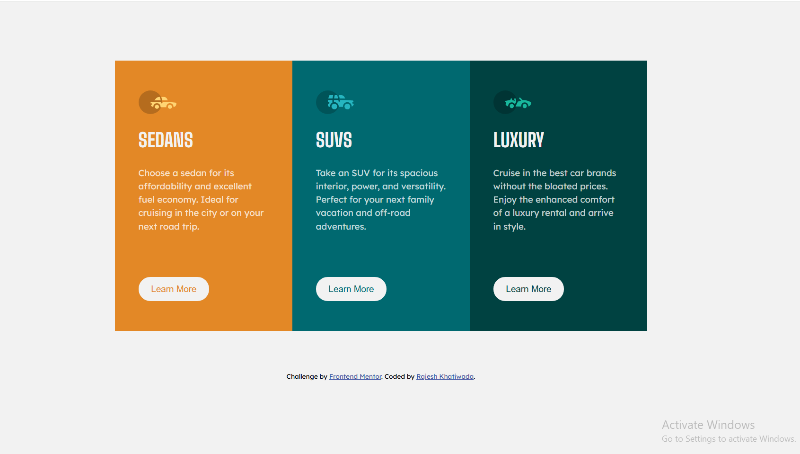

# 3 Column Preview Card Component

A responsive 3-column card layout built as part of the Frontend Mentor challenge.  
This project focuses on mastering layout systems like Flexbox and improving responsive UI structuring using HTML and CSS.

---

## 📸 Screenshot



---

## 🛠️ Built With

- HTML5
- CSS3
- Flexbox
- CSS Variables
- Responsive Design
- Mobile-first workflow

---

## 📌 Features

- Clean 3-column layout design
- Fully responsive layout (mobile → desktop)
- Hover effects on buttons for better interactivity
- Structured and reusable card components
- Pixel-perfect implementation of challenge design

---

## 📁 Project Structure


3-column-preview-card-component-main/
├── index.html
├── style.css
├── images/
│ └── (assets used in project)
├── screenshot.png
└── README.md


---

## 📖 What I Learned

While building this project, I practiced:

- Creating multi-column layouts using Flexbox
- Handling responsive design with media queries
- Improving spacing and alignment across components
- Designing reusable card-based UI structures
- Working with hover states and button interactions

---

## 🚀 Future Improvements

- Add smooth hover animations
- Improve accessibility (ARIA labels + semantic HTML)
- Convert into a React component
- Add grid-based layout alternative version

---

## 👨‍💻 Author

- GitHub: [@KhatiwadaR](https://github.com/KhatiwadaR)
```
